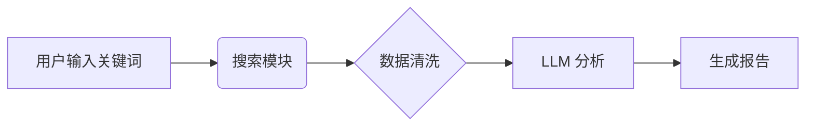

## 工作流介绍

该工作流旨在帮助分析师快速生成行业研究报告的初稿。它自动聚合新闻、财报和社交媒体数据，进行情感分析和趋势预测。

## 流程步骤

1.  **数据采集**: 扫描指定行业的最新新闻和财报。
2.  **信息清洗**: 去除广告和无关信息，提取核心数据。
3.  **分析推理**: 使用 LLM 进行SWOT分析和趋势预测。
4.  **报告生成**: 按照标准格式输出 Markdown 或 PDF 报告。

## 架构图

